<div align="center">



# AthleteIQ

### AI Sports Performance Platform for Indian Academies

[](https://athlete-iq-dun.vercel.app)
[](https://athleteiq-9r76.onrender.com)
[](https://react.dev)
[](https://fastapi.tiangolo.com)
[](https://supabase.com)

*Turning local Indian sports clubs into Elite Performance Centers — through AI.*

</div>

---

## What is AthleteIQ?

AthleteIQ is a full-stack SaaS platform built for small-to-medium Indian sports academies. It gives coaches the same performance intelligence tools used by national teams — without the ₹5L/year price tag or hardware requirement.

Built by a **21-year-old National Champion athlete** who experienced firsthand what coaching data gaps cost athletes at the highest level.

> **"Less than ₹35 per athlete per month. Less than one protein bar."**

---

## The Problem

| Current Reality | With AthleteIQ |
|---|---|
| Coach tracks 30+ athletes in a notebook | Live squad dashboard, 30-second refresh |
| Session logging takes 20+ minutes | Bulk log entire squad in under 3 minutes |
| Injuries discovered after they happen | AI flags overtraining risk 5–14 days early |
| Parents call coach for updates | Automated WhatsApp insights, read-only portal |
| No data on who is ready for match day | Readiness score 0–100 per athlete, every session |

---

## Core Features

### For Coaches
- **Live Squad Dashboard** — real-time wellness view across all athletes, sport-scoped for assistant coaches
- **Bulk Session Logger** — 3-step flow (Duration → Effort → Review) logs a 50-athlete squad in under 3 minutes
- **AI Readiness Engine** — ACWR (Acute:Chronic Workload Ratio) + Groq Llama 3.3-70B generates a 0–100 readiness score per athlete per session
- **Deception Detection** — flags athletes whose self-reported wellness contradicts their training load signature
- **Drill & Session Planner** — AI generates sport-specific warm-up, main session, and recovery plans on demand
- **Injury Log** — timestamped injury records with coach notes, visible to athlete and parent
- **Attendance Tracker** — 30-day visual grid, present/absent per session
- **Weekly AI Reports** — auto-generated PDF summaries: who improved, who's at risk, top performer

### For Athletes
- **Daily Wellness Check-in** — 4-metric swipe (Energy, Sleep, Soreness, Mood) in under 30 seconds
- **Personal Dashboard** — trend charts, readiness history, injury timeline
- **Mental Performance Suite** — Box Breathing, 4-7-8, Body Scan, Visualization (voice + visual guided)

### For Parents
- **Recovery Portal** — read-only wellness view with narrative AI insights in plain language
- **WhatsApp Broadcast** — AI-generated recovery advice delivered directly via WhatsApp deep-link
- **Home Recovery Advice** — sport-specific exercises and rest protocols sent after each session

### Platform
- **Role-Based Access** — Admin, Sport-Specific Coach, Athlete, Parent — each scoped to exactly what they need
- **Razorpay Payments** — full subscription flow with webhook-based plan activation
- **14-Day Free Trial** — auto-expiry gate, soft-locks premium features on expiry
- **Legal Compliance** — DPDP Act 2023, IT Rules 2021, Consumer Protection Act 2019

---

## Tech Stack

| Layer | Technology | Why |
|---|---|---|
| **Frontend** | React 18 (Create React App) | Fast iteration, component reuse across 4 user roles |
| **Styling** | Tailwind CSS + inline CSS animations | Zero design system dependency, full custom UI |
| **Backend** | FastAPI (Python 3.11) | Async-first, auto-docs, 3x faster than Flask for AI routes |
| **Database** | Supabase (PostgreSQL) | Row-level security, realtime, free tier scales to 500MB |
| **AI Engine** | Groq API — LLaMA 3.3 70B | 100K tokens/day free, sub-second inference for ACWR narration |
| **Auth** | Custom JWT via Supabase | Role-scoped tokens, no third-party auth overhead |
| **Payments** | Razorpay | India-first, UPI + cards + NetBanking, webhook plan activation |
| **Frontend Deploy** | Vercel | Auto-deploy on push, edge CDN, zero config |
| **Backend Deploy** | Render | Docker-less FastAPI deploy, UptimeRobot keep-alive |
| **PDF Export** | html2pdf.js | Client-side weekly report PDF generation, no server cost |
| **Fonts** | Bebas Neue + DM Sans | High-performance sports aesthetic, Google Fonts CDN |

---

## Architecture

```
┌─────────────────────────────────────────────────────┐
│                    CLIENT LAYER                      │
│  React 18 (Vercel CDN)  ·  4 Role-Based UX Flows    │
│  Coach │ Athlete │ Parent │ Admin                   │
└──────────────────────┬──────────────────────────────┘
                       │ HTTPS / Axios
┌──────────────────────▼──────────────────────────────┐
│                   API LAYER (FastAPI)                │
│  /auth  /athletes  /wellness  /ai  /session-planner │
│  /attendance  /injuries  /reports  /payments        │
│  Render · uvicorn · async · UptimeRobot keep-alive  │
└────────────┬──────────────────────┬─────────────────┘
             │                      │
┌────────────▼──────┐   ┌───────────▼─────────────────┐
│  Supabase         │   │  Groq API (LLaMA 3.3 70B)   │
│  PostgreSQL       │   │  ACWR Calculation            │
│  8 Core Tables    │   │  Readiness Narration         │
│  RLS Policies     │   │  Drill Plan Generation       │
│  12h AI Cache     │   │  Deception Flagging          │
└───────────────────┘   └─────────────────────────────┘
```

**Key architectural decisions:**
- **12-hour AI insight cache** in Supabase — prevents Groq rate limit hits across 100+ daily requests
- **`safe_supabase_query` wrapper** — handles stale connection ReadErrors on the free tier without downtime
- **In-memory session cache** on all `/ai/*` routes — sub-100ms repeat requests
- **Soft deletes** across athletes and coaches — `is_deleted` flag, data never lost
- **WEB_CONCURRENCY=1** on Render — prevents memory overflow on 512MB free instance

---

## Database Schema

```
academies          → academy_id, name, email, plan, trial_ends_at
athletes           → athlete_id, academy_id, name, sport, is_deleted
wellness_logs      → log_id, athlete_id, energy, sleep, soreness, mood, created_at
session_logs       → session_id, academy_id, sport, duration, avg_rpe, created_at
injury_logs        → injury_id, athlete_id, description, status, created_at
attendance_logs    → id, athlete_id, session_id, status, created_at
weekly_reports     → report_id, academy_id, content, created_at
ai_insights_cache  → cache_id, athlete_id, insights, expires_at
```

---

## Local Development

**Prerequisites:** Python 3.11+, Node 18+, Supabase project, Groq API key

```bash
# Clone
git clone https://github.com/Jsn04/AthleteIQ.git
cd AthleteIQ

# Backend
cd backend
python3 -m venv venv
source venv/bin/activate        # Windows: venv\Scripts\activate
pip install -r requirements.txt

# Add your .env
cp .env.example .env            # fill in SUPABASE_URL, SUPABASE_KEY, GROQ_API_KEY, RAZORPAY keys

uvicorn main:app --reload       # → http://localhost:8000

# Frontend (new terminal)
cd ../frontend
npm install
npm start                       # → http://localhost:3000
```

**Test Credentials (demo only):**
| Role | Password |
|---|---|
| Admin/Head Coach | `admin123` |
| Sport Coach | `cricketcoach123`, `badmintoncoach123`, etc. |
| Athlete | `firstnamelastinitial123` (e.g. `rahuls123`) |

---

## Competitive Landscape

| Platform | Price | AI Wellness | Indian Sports | Hardware Needed |
|---|---|---|---|---|
| **AthleteIQ** | ₹999–4,999/mo | ✅ Full | ✅ Built for it | ❌ Zero |
| Catapult | ₹5L+/yr | Partial | ❌ | ✅ GPS required |
| Hudl | ₹5L+/yr | ❌ | ❌ | ✅ Camera setup |
| Sportzy / SpnyPRO | ₹500–2k/mo | ❌ | ✅ | ❌ | 
| TeamBuildr | ₹3k+/mo | ❌ | ❌ | ❌ |

---

## Pricing

| Tier | Price | Target |
|---|---|---|
| **Founding 15** | ₹999/mo (locked for life) | First 15 academies — early adopter lock-in |
| **Pro** | ₹2,499/mo | 30–100 athletes |
| **Elite** | ₹4,999/mo | 120+ athletes, multi-coach |

Infrastructure cost at 15 paying academies: **₹0** (all free tiers).

---

## Roadmap

- [x] Role-based authentication (Coach / Athlete / Parent / Admin)
- [x] Bulk session logger (3-step, <3 min for 50+ athletes)
- [x] AI readiness engine (ACWR + Groq + deception detection)
- [x] Parent recovery portal + WhatsApp broadcast
- [x] Mental performance suite (5 guided exercises)
- [x] Injury log, attendance tracker, weekly AI PDF reports
- [x] Razorpay payment flow + webhook plan activation
- [x] Legal compliance pages (DPDP Act 2023)
- [ ] Tournament Countdown Mode — per-athlete readiness vs match date
- [ ] Monthly Progress Report Card — AI-generated, WhatsApp shareable
- [ ] Recovery Compliance Loop — parent confirms recovery done
- [ ] Personal Best Tracker — coach marks PBs, parent notified
- [ ] Fee Tracking + WhatsApp dues reminder
- [ ] Offline-first PWA — works without internet on training grounds

---

## About the Founder

**Jinesh Nanal** — 21-year-old National Champion athlete and sole technical founder.  
Built AthleteIQ after experiencing firsthand how coaching data gaps at the elite level directly cause injuries and underperformance. Every feature in this product comes from a real conversation with a coach, athlete, or parent.

**Siddhant Goyal** — Co-founder, Marketing & Partnerships.

---

## Contact

| | |
|---|---|
| Product / Tech | jineshnanal04@gmail.com |
| Partnerships / Sales | siddhantgoyal@gmail.com |
| Live App | [athlete-iq-dun.vercel.app](https://athlete-iq-dun.vercel.app) |

---

<div align="center">

**Built in Pune, India · 2026**

*If you're a coach reading this — [try it free for 14 days](https://athlete-iq-dun.vercel.app). No credit card.*

</div>
